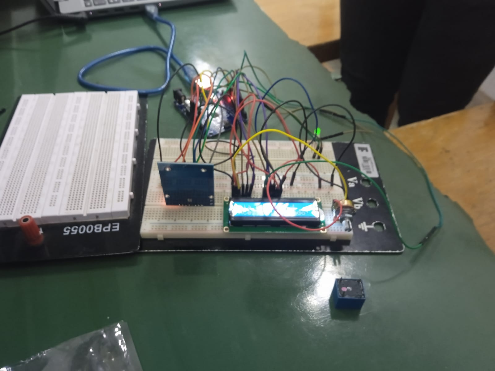
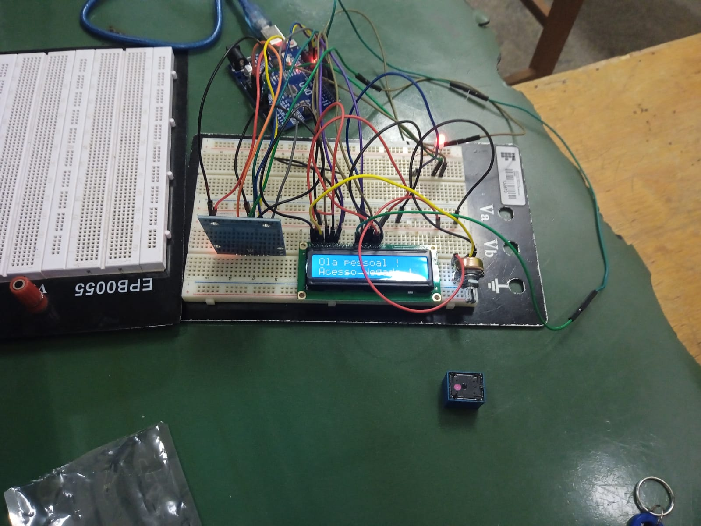

# 🔐 Sistema Embarcado de Controle de Acesso com RFID e Arduino

## 📸 Demonstração




## 📌 Descrição

Este projeto consiste no desenvolvimento de um sistema embarcado de controle de acesso utilizando tecnologia RFID e Arduino. O sistema é capaz de identificar usuários por meio de tags RFID e liberar ou negar acesso com base em uma validação pré-definida.

## 🎯 Objetivo

Simular um sistema real de controle de entrada utilizado em ambientes corporativos e institucionais, aplicando conceitos de eletrônica, sistemas embarcados e programação.

## ⚙️ Tecnologias Utilizadas

* Arduino UNO
* Módulo RFID RC522
* Display LCD 16x2
* Linguagem C/C++
* Comunicação SPI

## 🧠 Funcionamento do Sistema

1. O usuário aproxima um cartão/tag RFID do leitor
2. O sistema realiza a leitura do UID da tag
3. O UID é comparado com uma lista de usuários autorizados
4. O sistema responde em tempo real:

   * ✅ Acesso permitido → sinalização por LED + mensagem no LCD
   * ❌ Acesso negado → sinalização por LED + mensagem no LCD

## 🔌 Componentes Utilizados

* Arduino UNO
* Módulo RFID RC522
* Display LCD 16x2
* LED bicolor
* Resistores (270Ω)
* Potenciômetro (10kΩ)
* Jumpers

## 🧩 Arquitetura do Sistema

O sistema foi estruturado com base em:

* Leitura de dados via protocolo SPI (RFID)
* Processamento lógico no microcontrolador
* Saída de dados via display LCD
* Sinalização visual com LEDs

## 📊 Resultados

O sistema apresentou funcionamento estável, realizando corretamente a leitura das tags RFID e a validação de acesso, com resposta em tempo real e feedback visual eficiente.

## 🎥 Demonstração do Projeto

👉 https://youtu.be/X8uaER6ztJg

## 📁 Estrutura do Repositório

```
rfid-access-control-arduino/
│── README.md
│── codigo/
│── imagens/
│── video/
│── docs/
```

## 🚀 Possíveis Melhorias

* Implementação de registro de acessos (log)
* Integração com banco de dados
* Comunicação via Wi-Fi (ESP8266/ESP32)
* Interface web para gerenciamento de usuários
* Sistema de autenticação mais robusto

## 👨‍💻 Autor

Ulysses Freire da Silva
Estudante de Engenharia Elétrica – IFCE (Campus Cedro)

## 📌 Observação

Projeto desenvolvido em disciplina de Sistemas Microprocessados, com foco em aplicações reais de automação e controle.
